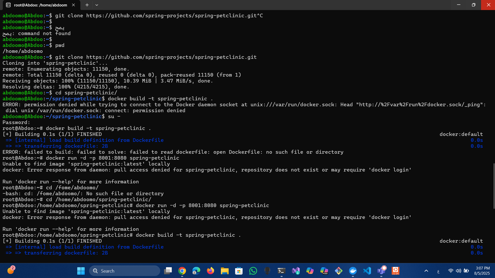
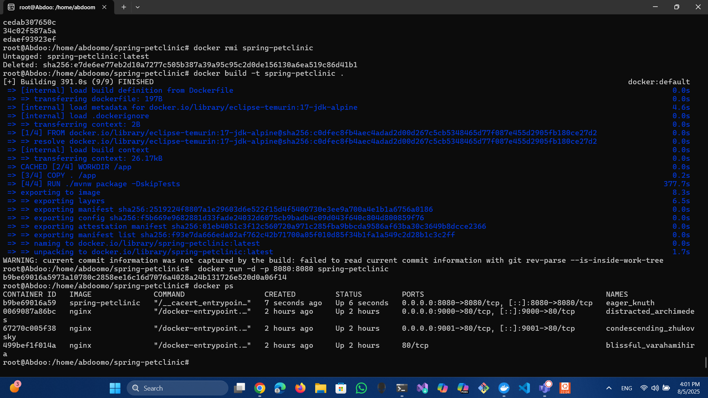
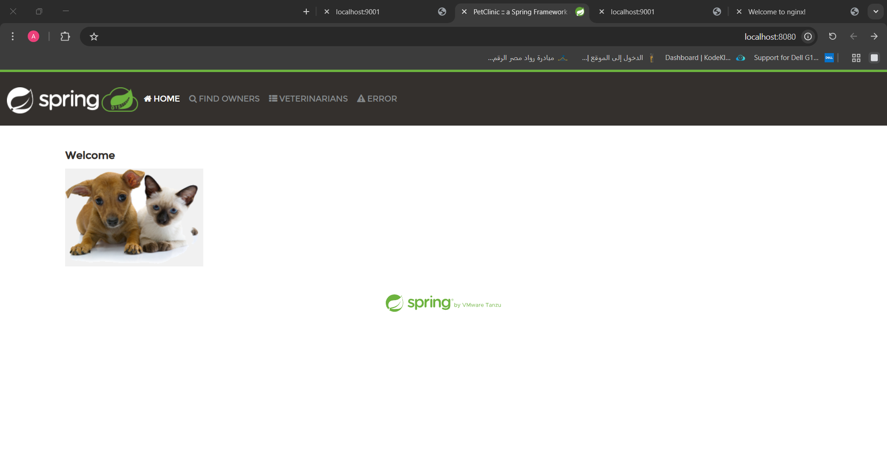

Pull nginx and make it run on 9000:80 and do login

Open the nginx page on browser 

Run nginx on another port 9001

Open the nginx page on browser 

Enter the nginx container

Change the conf 

Open the nginx page on browser and see the new conf 

clone the bit clinic project and build the container 

Made the container 

Open the bitclinic page on browser 

pull the images

