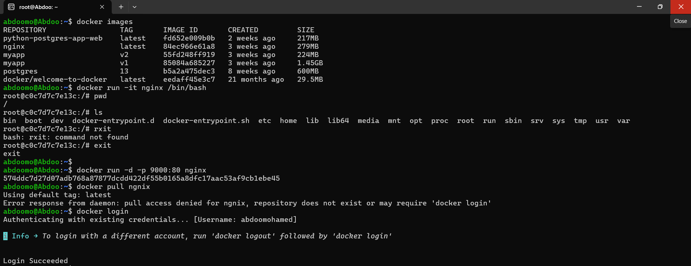
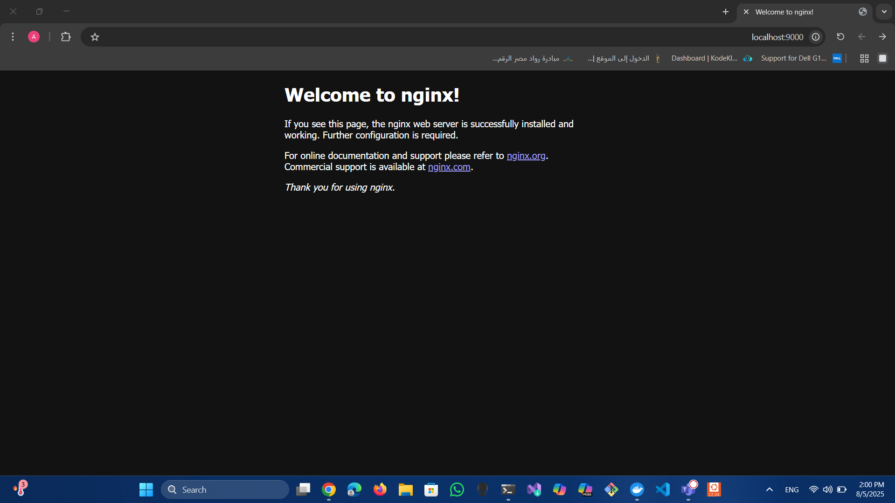
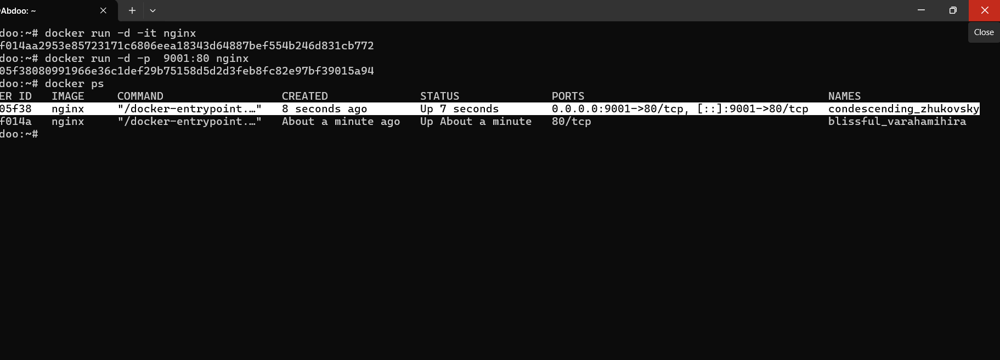
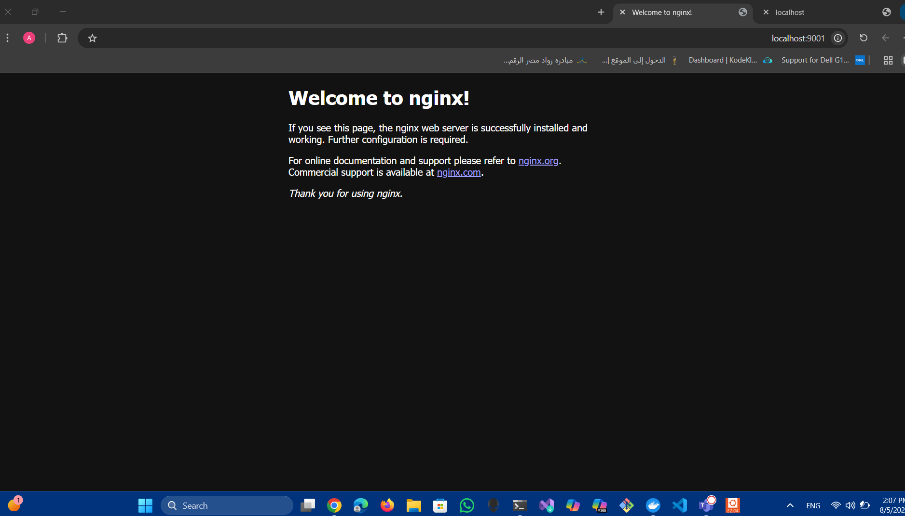
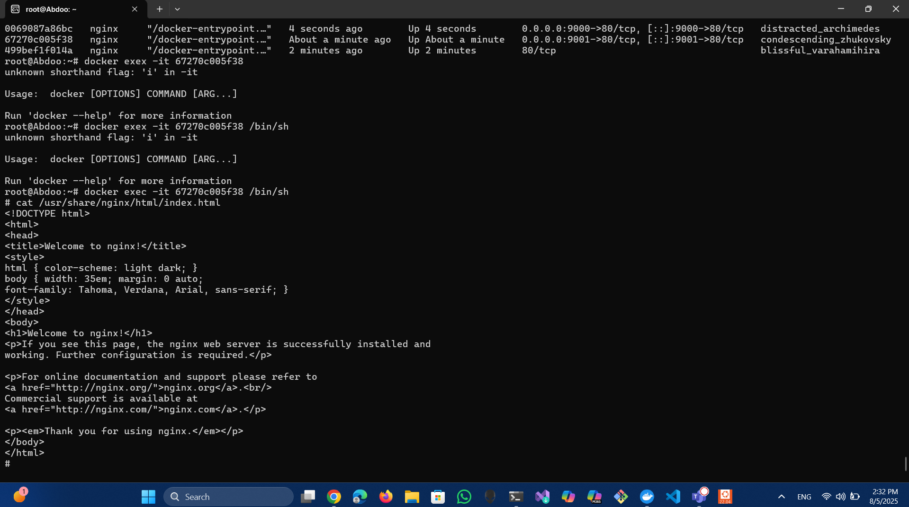
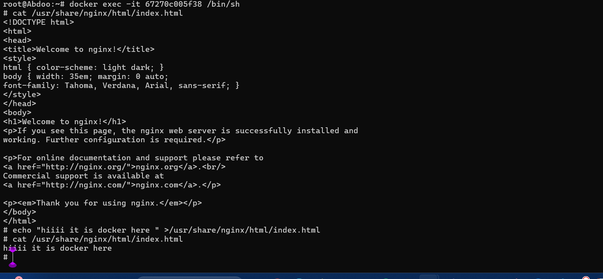
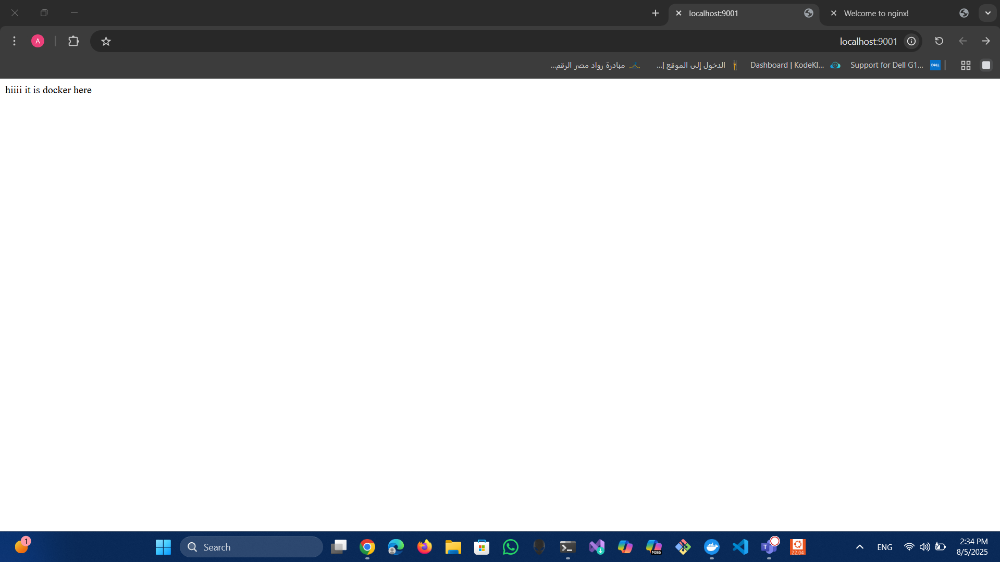
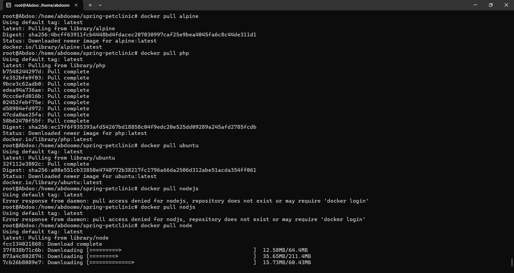

# 🐳 Docker Nginx and Spring PetClinic Guide

This guide demonstrates how to use Docker to run and manage an **Nginx web server**, a **Spring PetClinic** application, and how to pull common base images.

---

## 1️⃣ Nginx Web Server

### Step 1: Login and Run Nginx
Login to Docker, pull the latest Nginx image, and run a container mapping host port **9000** to container port **80**:

docker login  
docker pull nginx  
docker run -d -p 9000:80 nginx  

---

### Step 2: View Nginx in the Browser
Open your browser and navigate to **http://localhost:9000** to see the default Nginx welcome page.

---

### Step 3: Run Nginx on a Different Port
Run another instance of Nginx on port **9001**:

docker run -d -p 9001:80 nginx  

Check running containers:

docker ps  

---

### Step 4: Access the Second Nginx Instance
Go to **http://localhost:9001** — you should see the Nginx page again.

---

## 2️⃣ Modifying the Nginx Content

### Step 5: Enter the Container
Execute a shell inside the running container:

docker exec -it <container_id> /bin/sh  

---

### Step 6: Change the Default Page
Replace the default `index.html`:

echo "hiiii it is docker here" > /usr/share/nginx/html/index.html  

---

### Step 7: View the Changes
Refresh **http://localhost:9001** to see your new content.

---

## 3️⃣ Spring PetClinic Application

### Step 8: Clone and Build the Project
Clone the PetClinic repo and build the Docker image:

git clone https://github.com/spring-projects/spring-petclinic.git  
cd spring-petclinic  
docker build -t spring-petclinic .  

.jpg)

---

### Step 9: Run the Application Container
Run the PetClinic container on port **8080**:

docker run -d -p 8080:8080 spring-petclinic  

.jpg)

---

### Step 10: Access the Application
Open **http://localhost:8080** — the Spring PetClinic app should be running.

.png)

---

## 4️⃣ Pulling Different Docker Images

Here we pull several common base images from Docker Hub.

### Step 11: Pull Alpine (lightweight base)
docker pull alpine  
✅ Pulled successfully.  

---

### Step 12: Pull PHP
docker pull php  
✅ Pulled successfully.  

---

### Step 13: Pull Ubuntu
docker pull ubuntu  
✅ Pulled successfully.  

---

### Step 14: Pull Node.js
At first, `docker pull nodejs` and `docker pull nodjs` failed because those repos don’t exist.  
The correct image name is **node**:

docker pull node  
✅ Image downloads successfully.  

---

